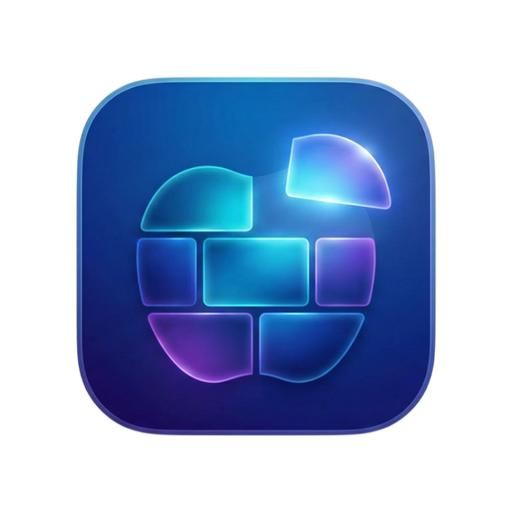

<p align="center">
  
</p>

<h1 align="center">KTApple</h1>

<p align="center">
  <strong>KDE Plasma KWin Tiling — reimagined for macOS</strong>
</p>

<p align="center">
  <a href="https://github.com/m96-chan/KTApple/releases/latest"></a>
  <a href="https://github.com/m96-chan/KTApple/actions/workflows/test.yml"></a>
  <a href="LICENSE"></a>
  
  
</p>

---

> A tiling window manager that brings the flexibility of KDE Plasma's KWin Tiling to macOS.
> Design your tile layout visually, drop windows in with Shift+Drag, and resize by dragging boundaries — no config files needed.

## Why KTApple?

Existing macOS tiling WMs force you into fixed layouts or text-based configs.
KTApple takes the approach KDE Plasma got right: **a visual editor where you design the layout you want**.

| | KTApple | yabai | AeroSpace | Amethyst | Rectangle |
|---|:---:|:---:|:---:|:---:|:---:|
| Visual Tile Editor | **Yes** | — | — | — | — |
| Free Tile Placement | **Yes** | BSP only | i3 tree | Fixed | Presets |
| Shift+Drop Placement | **Yes** | Zones | — | — | Snap |
| Gap-Drag Resize | **Yes** | — | — | — | — |
| No SIP Required | **Yes** | Partial | Yes | Yes | Yes |
| GUI Settings | **Yes** | CLI | TOML | GUI | GUI |

## Quick Start

### Install via Homebrew

```sh
brew tap m96-chan/homebrew-tap
brew install --cask --no-quarantine ktapple
```

### Or download manually

1. Grab the `.dmg` from [**Releases**](https://github.com/m96-chan/KTApple/releases/latest)
2. Move `KTApple.app` to `/Applications`
3. Remove quarantine: `xattr -cr /Applications/KTApple.app`
4. Grant Accessibility permission in **System Settings > Privacy & Security > Accessibility**

> [!NOTE]
> KTApple is ad-hoc signed (no Apple Developer Program). Gatekeeper bypass via `xattr -cr` or Homebrew `--no-quarantine` is required.

## Key Features

### Visual Tile Editor (`⌃⌥T`)

Split, resize, and delete tiles through an interactive GUI.
Layouts are stored in normalized 0.0–1.0 coordinates — resolution-independent and portable.

```
┌────────────┬──────────┐
│            │   Top-R  │
│   Left     ├──────────┤
│   (60%)    │ Bottom-R │
│            │  (40%)   │
└────────────┴──────────┘
```

### Shift+Drop Window Placement

Hold <kbd>Shift</kbd> while dragging any window. A tile highlight appears — release to snap the window into place.

### Gap-Drag Resize

Drag the boundary line between any two tiles. Both adjacent windows resize in real time.

### Keyboard Shortcuts

| Shortcut | Action |
|---|---|
| <kbd>⌃</kbd><kbd>⌥</kbd><kbd>T</kbd> | Open tile editor |
| <kbd>⌃</kbd><kbd>⌥</kbd> + Arrow | Move focus |
| <kbd>⌃</kbd><kbd>⌥</kbd><kbd>⇧</kbd> + Arrow | Move window |
| <kbd>⌃</kbd><kbd>⌥</kbd><kbd>F</kbd> | Toggle float |
| <kbd>⌃</kbd><kbd>⌥</kbd><kbd>M</kbd> | Toggle maximize |
| <kbd>⌃</kbd><kbd>⌥</kbd><kbd>=</kbd> / <kbd>-</kbd> | Expand / shrink tile |

## Architecture

```
KTApple
├── TileManager         Per-display tile tree management
├── TileEditor          Visual tile editor (SwiftUI)
├── WindowManager       Window ops via Accessibility API
├── HotkeyManager       Global shortcut registration
├── DragDropHandler     Shift+Drag detection & tile snapping
├── GapResizeHandler    Boundary drag-resize handling
├── LayoutStore         JSON layout persistence
└── DisplayObserver     Monitor hotplug observation
```

<details>
<summary><strong>Tile Tree Structure</strong></summary>

Tiles follow the same tree model as KWin:

```
RootTile (Screen)
├── Tile (Left, 60%)
│   ├── Tile (Top-Left)
│   └── Tile (Bottom-Left)
└── Tile (Right, 40%)
    ├── Tile (Top-Right)
    └── Tile (Bottom-Right)
```

Each node carries:
- **proportion** — Size relative to siblings (0.0–1.0)
- **layoutDirection** — Horizontal / Vertical
- **children** — Arbitrary child count
- **windowIDs** — Assigned windows

</details>

<details>
<summary><strong>macOS API Usage</strong></summary>

| Layer | API |
|---|---|
| Window Operations | `AXUIElement` (Accessibility API) |
| Window Enumeration | `CGWindowListCopyWindowInfo` |
| Global Events | `CGEvent` Tap / `NSEvent.addGlobalMonitorForEvents` |
| Hotkeys | `Carbon.HIToolbox` (RegisterEventHotKey) |
| Display Monitoring | `CGDisplayRegisterReconfigurationCallback` |
| UI | SwiftUI |

</details>

## Requirements

- **macOS 14.0+** (Sonoma)
- **Swift 6 / Xcode 16+** (to build from source)
- **Accessibility permission**
- No SIP disable required

## Documentation

| Guide | Description |
|---|---|
| [Getting Started](docs/getting-started.md) | Installation, setup, first steps |
| [Keyboard Shortcuts](docs/keyboard-shortcuts.md) | Full shortcut reference |
| [Architecture](docs/architecture.md) | Internals for contributors |

## Contributing

Contributions are welcome! Please open an issue first to discuss what you'd like to change.

```sh
git clone https://github.com/m96-chan/KTApple.git
cd KTApple
swift build
swift test
```

## License

[GPL-3.0](LICENSE)
